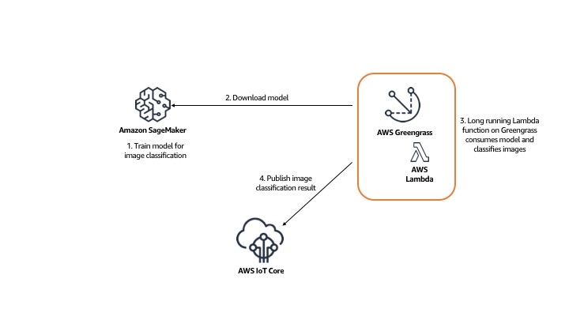
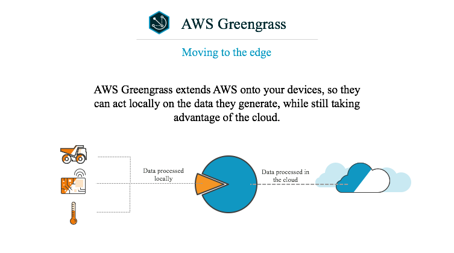
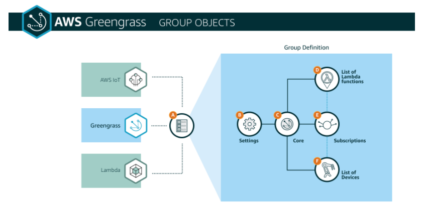

## Introduction

이 워크샵을 통해 AWS Greengrass ML 추론 및 Amazon SageMaker의 개념을 배우고, Amazon SageMaker로 기계 학습 모델을 생성 및 모델을 Greengrass Core에 배포하고, Lambda 함수를 사용하여 Greengrass Core에서 ML 추론을 실행하는 방법을 실습에서 배울 수 있습니다. \
이 Workshop은 AWS Cloud9 환경 및 Amazon SageMaker 노트북 인스턴스를 사용하여 수행되도록 설계되었습니다.\
AWS Greengrass가 Cloud9 인스턴스에서 구성 및 실행됩니다. \
Workshop 환경은 AWS CloudFormation으로 자동 생성됩니다. \
Amazon Linux가 Cloud9 및 SageMaker의 운영 체제로 사용되며 표준 사용자는 ***ec2-user***입니다. \
AWS Cloud9에는 클라우드에서 소프트웨어를 코딩, 빌드, 실행, 테스트, 디버깅 및 릴리스하는 데 사용하는 도구 모음이 포함되어 있습니다. 이러한 도구를 사용하려면 AWS Cloud9 통합 개발 환경 또는 IDE를 사용하십시오. 또한 이 워크샵의 실습에 필요한 브라우저에서 셸(shell) 액세스를 제공합니다.

### 준비사항

* AWS 계정: 자원을 생성할 수 있는 권한이 필요합니다. 
* 브라우저: 최신 버전의 크롬, 파이어폭스를 사용하세요.  

관리자 권한이 있는 AWS 계정
노트북
브라우저

### Workshop Content

이 세션은 엣지(edge)에서 머신 러닝 솔루션을 만드는 것에 관한 것입니다.\
AWS Greengrass는 연결된 디바이스에서 엣지(edge)에서 안전한 방식으로 로컬 컴퓨팅, 메시징, 데이터 캐싱, 동기화 및 ML 추론 기능을 실행할 수있는 소프트웨어입니다.\
Amazon SageMaker는 개발자와 데이터 과학자가 모든 규모의 기계 학습 모델을 쉽고 빠르게 구축, 교육 및 배포 할 수 있도록하는 완전히 관리되는 플랫폼입니다.\

이 workshop을 통하여

* Amazon SageMaker로 이미지를 분류하기 위해 머신 러닝 모델 트레이닝
* Greengrass 그룹 프로비저닝
* Amazon SageMaker로 훈련 된 모델을 AWS IoT Greengrass에 다운로드
* AWS IoT Greengrass에서 사용할 AWS Lambda 함수 생성
* Lambda 함수를 사용하여 Greengrass에서 이미지 분류를 수행하십시오. Lambda 함수는 Greengrass에 배포 된 모델을 로드합니다.

### Architecture

## Introduction into Amazon SageMaker

Amazon SageMaker는 완전히 관리되는 머신 러닝 서비스입니다. 데이터 과학자와 개발자는 Amazon SageMaker를 사용하여 기계 학습 모델을 쉽고 빠르게 구축 및 교육 한 후 프로덕션 환경에서 호스팅되는 환경에 직접 배포 할 수 있습니다.
탐색 및 분석을 위해 데이터 소스에 쉽게 액세스 할 수 있도록 통합 Jupyter 저작 노트북 인스턴스를 제공하므로 서버를 관리 할 필요가 없습니다. 또한 분산 환경에서 매우 큰 데이터에 대해 효율적으로 실행되도록 최적화된 공통 기계 학습 알고리즘을 제공합니다.

## Introduction to AWS Greengrass

AWS Greengrass는 AWS 클라우드 기능을 로컬 디바이스로 확장하여 해당 디바이스가 정보 소스에 더 가까운 데이터를 수집 및 분석하는 동시에 로컬 네트워크에서 서로 안전하게 통신 할 수 있는 소프트웨어입니다. 보다 구체적으로, AWS Greengrass를 사용하는 개발자는 클라우드에서 서버리스 코드 (AWS Lambda 함수)를 작성하여 애플리케이션의 로컬 실행을 위해 디바이스에 편리하게 배포할 수 있습니다.

### Greengrass Group

AWS Greengrass 그룹 정의는 AWS Greengrass 핵심 장치 및 이와 통신하는 장치에 대한 설정 모음입니다. 다음 다이어그램은 AWS Greengrass 그룹을 구성하는 객체를 보여줍니다.

---

© 2020 Amazon Web Services, Inc. 또는 자회사, All rights reserved.

