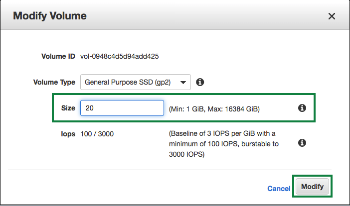

### CloudFormation을 활용한 AWS Resource 생성

이 워크샵에 필요한 AWS 리소스를 생성하기 위해 CloudFormation 스택을 제공합니다.\
CloudFormation 스택은 AWS Greengrass를 실행하는 데 사용될 EC2 인스턴스를 다른 리소스 중에서 생성합니다. 또한 SageMaker 노트북 인스턴스가 생성되고 부트 스트랩됩니다.\
아래 링크를 선택하면 스택이 시작될 AWS 콘솔의 CloudFormation 으로 자동 redirection됩니다.

* [Launch CloudFormation stack in us-east-1 (N. Virginia)](https://console.aws.amazon.com/cloudformation/home?region=us-east-1#/stacks/create/review?stackName=GGMLWorkshop&templateURL=https://public-cloudformation.s3.ap-northeast-2.amazonaws.com/cfn-iot-gg-ml-c9-workshop-20190502_modified.json)


CloudFormation 스택은 최소한 다음 리소스를 만듭니다.

* SageMaker에 필요한 S3 버킷
* EC2 및 SageMaker 인스턴스에 퍼블릭 서브넷 + 보안 그룹이있는 VPC
* Greengrass를 실행하고 Lambda 함수를 생성하는 Cloud9 인스턴스
* Jupyter 노트북에서 모델을 정의하는 SageMaker 노트북 인스턴스. 모델 자체는 AWS SageMaker 서비스를 사용하여 학습됩니다.
* Cloud9 인스턴스의 인스턴스 프로파일
* AWS 리소스에 액세스하는 데 필요한 IAM 역할

AWS CloudFormation 콘솔의 Quick create stack 페이지로 리디렉션 된 후 다음 단계를 수행하여 스택을 시작하십시오.

* EC2 Instance Type for Cloud9: (Optional) Cloud9 instance type을 선택합니다. 미리 설정된 ***m4.large***을 사용하면 workshop을 실행하는 데에 충분합니다.
* EC2 Instance Type for Sagemaker: (Optional) SageMaker를 위한 instance type을 선택합니다. 미리 설정된 ***ml.t2.medium***을 사용하면 workshop을 실행하는 데에 충분합니다.
* Capabilities 에서 ***I acknowledge that AWS CloudFormation might create IAM resources***을을 체크합니다.
* Create stack 버튼을 누르고, stack 생성이 완료될 때까지 기다립니다. 10분 정도 소요됩니다.


CloudFormation 콘솔의 스택에 대한 ***Output*** 섹션에서 생성 된 리소스에 대한 정보르 찾을 수 있습니다. 언제든지 ***Output*** 섹션으로 돌아와서 값을 확인할 수 있습니다.


#### Modify Volume 및 Cloud9 IDE에 접속

실습 환경에서 디스크 저장 공간을 확보하기 위하여, [EC2의 EBS console](https://console.aws.amazon.com/ec2/v2/home?#Volumes)로 이동합니다.

***Modify Volume***을 선택합니다.


Size에 ***20***을 입력하고, ***Modify***를 클릭합니다.



Modify Volume 확인창에서 ***Yes***를 클릭합니다.


Modify Volume 이 성공하면 아래와 같은 창이 보여집니다.


생성하신 ***GGMLWorkshop***스택에서 CloudFormation 콘솔의 스택에 대한 ***Output*** 섹션을 확인합니다.
Cloud9IDE 항목의 링크에서 오른쪽 마우스를 클릭하여 ***Open link in new tab***선택합니다.


하기 화면과 같은 Cloud9 instance로 이동됩니다.


Cloud9IDE 에서 아래 두 줄의 명령을 실행하여, 볼륨의 사이즈를 조정해 줍니다.

``` shell
sudo growpart /dev/xvda 1
sudo resize2fs /dev/xvda1
```

그리고, 아래 명령으로 남은 저장 공간을 확인할 수 있습니다.

``` shell
df -h
```


#### home folder가 보여지도록 설정

Workshop에서 사용되는 많은 파일이 Cloud9 IDE에 복사되어 있습니다. 기본적으로 홈 폴더의 내용은 표시되지 않습니다. 따라서 이것을 변경해야합니다.


#### Open a Terminal

Cloud9 IDE에서 terminal (shell)을 열기 위해서 Tab bar에서 ***+***를 클릭하고 ***New Terminal***을 선택합니다.


수고하셨습니다. 실습 1을 완료하셨습니다.
