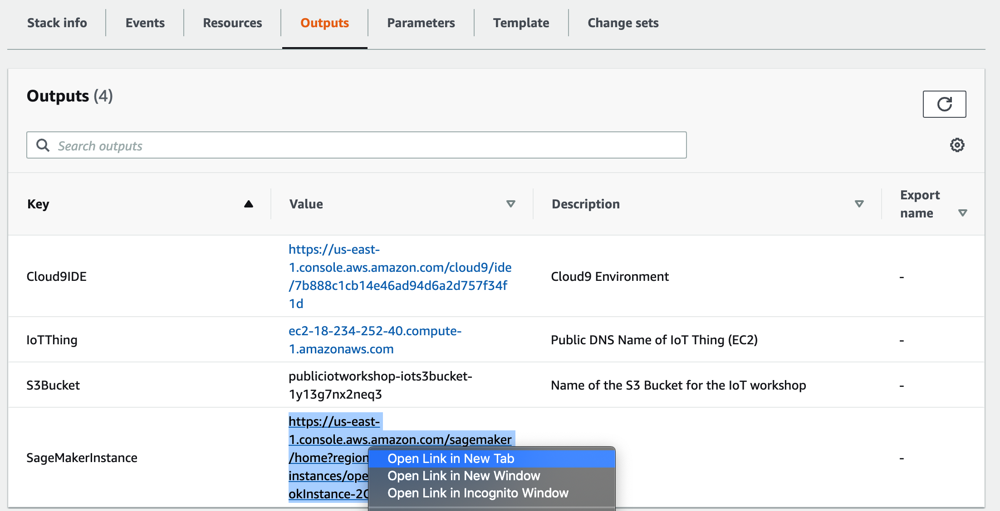
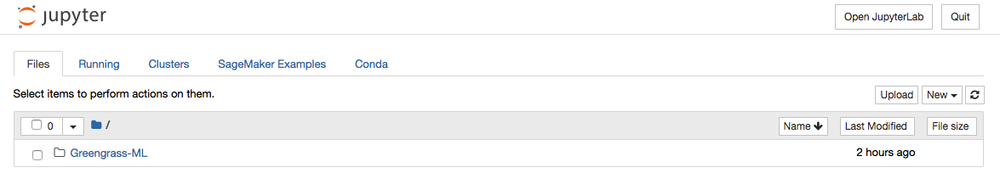
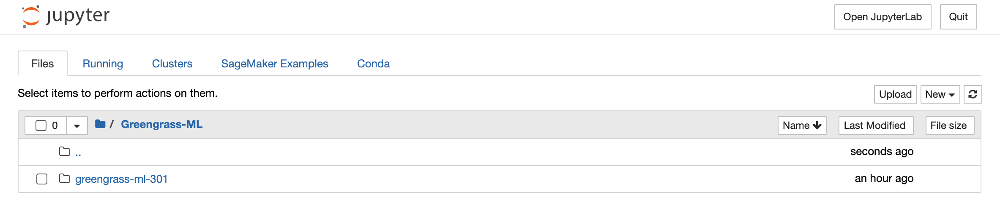
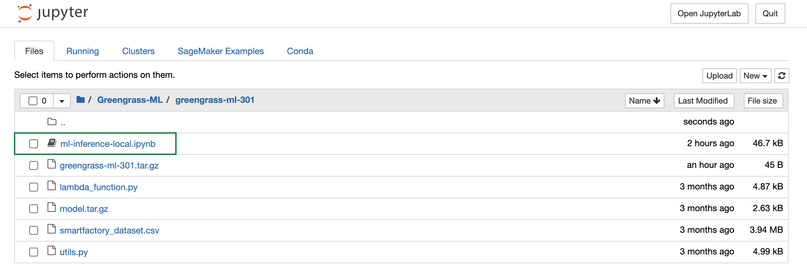
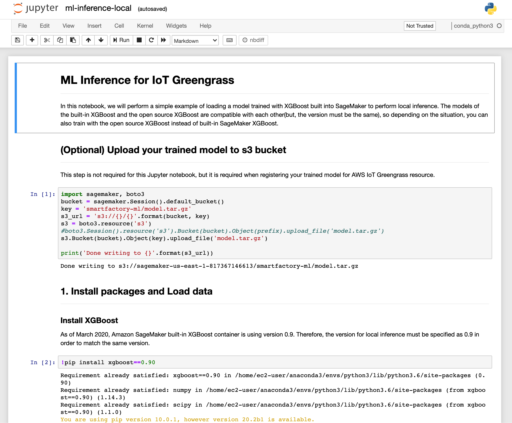

### Train a Model with Amazon SageMaker

Amazon SageMaker에서 Jupyter 노트북을 사용하여 이미지 분류 모델을 학습합니다. 훈련된 모델은 나중에 AWS Greengrass에서 사용되어 엣지에서 로컬 이미지 분류를 수행합니다.\
생성된 SageMaker 인스턴스의 이름은 CloudFormation 스택의 출력 섹션에서 찾을 수 있습니다.

노트북에 액세스하고 모델을 학습 시키려면 다음 단계를 실행하십시오.

#### Access the SageMaker Notebook Instance

생성하신 CloudFormation 스택에서 ***Output*** 섹션을 확인합니다.
SageMakerInstance 항목의 링크에서 ***오른쪽 마우스***를 클릭하여 ***Open link in new tab***선택합니다.

SageMaker instance로 이동됩니다.
***Greengrass-ML*** 폴더를 클릭합니다.

***greengrass-ml-301*** 폴더를 클릭합니다.

***ml-inference-local.ipynb***을 클릭하여 Jupyter notebook을 엽니다.

그리고, Model Training을 하기 위하여, notebook의 있는 내용대로 따라서 진행합니다.

#### Working with Jupyter notebooks

실행해야하는 코드가 포함 된 노트북의 셀(Cell)에는 좌측에 대괄호 []가 있습니다.

[ ] 셀(Cell)이 실행되지 않았습니다 \
[*] 셀(Cell)이 활성화되었습니다. 코드에 따라 셀을 실행하는 데 약간의 시간이 걸릴 수 있습니다 \
[X] 여기서 X는 [6]과 같은 숫자이며, 셀의 코드가 실행되었음을 의미합니다.

cell 실행 방법:\
화면 상단에 Run 사용 \
키보드에서 'Ctrl+<Enter>'을 입력
