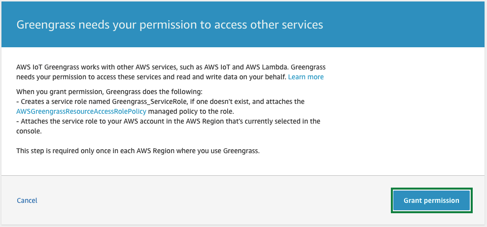

#### AWS Cloud에 Greengrass Group과 Core 생성

[AWS Greengrass console](https://console.aws.amazon.com/greengrass/)로 이동한 후, Greengrass 메뉴를 클릭합니다.
새로운 Greengrass Group을 생성하기 위하여, 화면과 같이 ***Create a Group***를  클릭합니다.


Greengrass가 Lambda와 같은 다른 AWS Service에 잡근하기 위한 권한 부여에 대한 동의가 필요합니다. ***Grant permission*** 버튼을 클릭하여 권한 부여에 동의하시면 Greengrass_ServiceRole과 같은 이름의 Service Role이 생성되며, 작업에 필요한 역할(role)이 Service Role에 추가됩니다.



Greengrass group을 셋업합니다. 여기서는 ***Use easy creation***을 클릭합니다.


생성할 Greengrass group의 이름을 지정합니다. 여기서는 ***greengrass-ml***를 사용합니다.
***Next***를 클릭하여, 다음 단계로 진행합니다.


Greengrass Core를 생성합니다. 앞서 지정한 이름을 기반으로 ***greengrass-ml_Core*** 라는 이름이 자동 생성됩니다. 
***Next***를 클릭하여, 다음 단계로 진행합니다.


'Run a scripted easy Group creation' 단계를 통하여, 나머지 단계를 진행합니다. ***Create Group and Core***를 클릭합니다.


***Download these resources as a tar.gz***를 클릭하여, device를 cloud에 연결하기 위하여 필요한 public key, private key와 certificate를 다운로드 받습니다.
반드시, ***Finish***를 클릭하여 Greengrass group과 core를 생성합니다.


<!-- #### Create a Greengrass Service Role

[IAM console](https://console.aws.amazon.com/iam/)로 이동합니다.
좌측 메뉴에서 ***Roles***를 클릭합니다. 그리고, ***Create role*** 버튼을 클릭합니다.


Select type of trusted entity에서 ***AWS service***를 선택하고, Choose the service that will use this role에서 ***Greengrass***를 선택합니다. 그리고, ***Next: Permission***를 클릭합니다.


{}
아래 Attach permissions policies 설정은 반드시 해 주셔야 됩니다.
{}

Attche permissions policies에서 ***AWSGreengrassResourceAccessRolePolicy***를 선택합니다 (탐색 창에서 검색합니다). 그리고, ***Next: Tags***를 클릭합니다.


Add tags (optional)를 통하여 tag를 추가할 수 있습니다. ***Next: Review***를 클릭합니다.


Role name에 ***GreengrassRole*** 을 입력하고, ***Create Role***을 클릭합니다.


IAM Role을 생성한 후 역할 ARN을 기록하고이를 사용하여 awscli 명령을 작성하십시오. IAM 콘솔에서 역할 arn을 찾을 수 있습니다.\
Role 메뉴의 검색 창에 위에서 생성한 ***GreengrassRole***을 입력합니다.\
***GreengrassRole***을 클릭합니다.


화면 상단에서 role arn을 찾을 수 있습니다.


Cloud9 터미널(terminal)에서 하기와 같은 명령으로 service role과 계정(account)을 연결합니다:
아래 command를 복사하여 cloud9에 붙여 넣었을 때 에러가 발생된다면, 직접 타이핑해 주셔야 합니다.

``` shell
aws greengrass associate-service-role-to-account --role-arn arn:aws:iam::<YOUR_AWS_ACCOUNT_ID>:role/GreengrassRole
```

아래는 예제입니다.

``` shell
aws greengrass associate-service-role-to-account --role-arn arn:aws:iam::576184218696:role/GreengrassRole
```

 -->


---
<p align="center">
© 2020 Amazon Web Services, Inc. 또는 자회사, All rights reserved.
</p>
