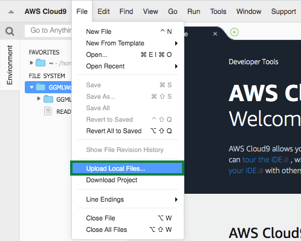

#### hardlink/softlink protection 설정

다음 명령과 같이 ggc_user와 ggc_group을 생성합니다.

``` shell
sudo adduser --system ggc_user
sudo groupadd --system ggc_group
```

시스템 설정 파일을 찾아서 편집합니다.
먼저 하기 폴더로 이동합니다.

``` shell
cd /etc/sysctl.d
ls
```

다음과 같은 명령으로 00-defaults.conf 파일을 수정합니다.

``` shell
sudo nano 00-defaults.conf
```

00-defaults.conf 파일의 제일 마지막에 아래 두 줄을 추가합니다.

```
fs.protected_hardlinks = 1
fs.protected_symlinks = 1
```

Cloud9 instance를 리부팅합니다.
``` shell
sudo reboot
```


#### Updating greengrass Core software

Cloud9(EC2)에 이미 이전 버전의 greengrass core software가 설치되어 있습니다만, 이것을 최신 버전으로 업그레이드애 해야 됩니다.

먼저, 이전 버전의 greengrass core software를 삭제합니다.

``` shell
sudo rm -rf /greengrass
```

그리고, 최신 버전의 greengrass core software를 다운로드하고, 루트(/)에 압축 해제 합니다.

``` shell
wget https://d1onfpft10uf5o.cloudfront.net/greengrass-core/downloads/1.10.0/greengrass-linux-x86-64-1.10.0.tar.gz
sudo tar -xzvf greengrass-linux-x86-64-1.10.0.tar.gz -C /
```

#### Java 8 runtime (JDK 8) 설치

Cloud9(EC2)에 이미 이전 버전의 JDK가 이미 설치되어 있습니다만, 이것을 JDK 8 이상으로 업그레이드해야 합니다.
Cloud9 terminal에서 아래와 같은 명령으로 이전 버전의 JDK를 삭제하고, JDK 8을 설치합니다.

``` shell
sudo yum remove java-1.7.0-openjdk
```

``` shell
sudo yum install java-1.8.0
```

Cloud9 terminal에서 다음 명령으로 JDK 버전이 1.8.0 이상인지 확인합니다.

``` shell
java -version
```

#### Copy and unpack the tar.gz-file

다운로드 한 tar.gz 파일을 EC2 인스턴스에 복사 (Lab1의 마지막 부분에서 언급 한대로 S3 / Cloud9 IDE 사용)하십시오. tar.gz 파일의 이름은 -setup.tar.gz와 유사합니다.
tar.gz 파일에는 Greengrass Core를 구성하는 데 사용될 키, 인증서 및 구성 파일 (config.json)이 포함되어 있습니다.



Cloud9 터미널에서 아래와 같은 명령으로 압축을 해제합니다.

``` shell
sudo tar zxvf <unique-string>-setup.tar.gz -C /greengrass/
```


#### ATS 루트 CA 인증서를 다운로드

ATS 앤드포인트에 접근하기 위하여 ATS 루트 CA 인증서를 다운로드합니다.

``` shell
cd /greengrass/certs/ 
sudo wget -O root.ca.pem https://www.amazontrust.com/repository/AmazonRootCA1.pem
```

#### Greengrass Core 시작

이제 Greengrass Core를 시작할 준비가되었습니다.

Greengrass Core를 시작하기 전에 [AWS IoT Core console](https://console.aws.amazon.com/iot/)로 이동한 후 Test 메뉴를 이용하여, ***$aws/events/#*** 와 ***$aws/things/#*** 토픽을 구독 신청합니다.


Cloud9 terminal에서 아래 명령을 실행합니다.

```
cd /greengrass/ggc/core
sudo ./greengrassd start
```

그리고, 다시 AWS IoT Core 콘솔에서 MQTT client의 출력을 확인합니다.


Greengrass Core의 로그 디렉토리에 액세스하려면 root 사용자로 전환해야 합니다.

``` shell
sudo su -
```

Cloud9 터미널에서 아래 명령을 실행합니다:

``` shell
cd /greengrass/ggc/var/log/system/
tail -f *.log
```

AWS Greengrass를 시작할 때 문제가 발생하면 "crash.log"파일에서 오류를 확인하십시오(문제가 없을 경우 이 단계는 건너 뛰시면 됩니다.).

``` shell
sudo cat /greengrass/ggc/var/log/crash.log
```

#### Enable Logging for Greengrass

Greengrass Core에는 기본적으로 로깅이 사용되지 않습니다. Core에서 발생하는 상황을 파악하고 문제 해결을 위해 로깅을 활성화해야합니다.

[Greengrass console](https://console.aws.amazon.com/greengrass/)로 이동한 후, Groups 메뉴를 선택합니다.

그리고, 앞서 생성한 ***greengrass-ml***을 클릭합니다.


***Settings***를 클릭하고, 페이지를 아래로 스크롤합니다.

Local logs configuration 에서 ***Edit***를 클릭합니다.
***Add another log type***를 클릭합니다.


***User Lambdas*** 와 ***Greengrass system*** 을 모두 체크하고 ***update***를 클릭합니다.


나머지 설정 값들은 default로 그대로 두고 ***Save***를 클릭합니다.


Greengrass Core의 Log files은 아래에 생성됩니다.

* Log directory: /greengrass/ggc/var/log
* System logs: /greengrass/ggc/var/log/system
* Lambda logs: /greengrass/ggc/var/log/user/<AWS_REGION>/<ACCOUNT_ID>

Greengrass Group을 만들거나 변경 한 후에는 구성을 Greengrass Core에 배포해야합니다.

먼저 Cloud9 terminal에서 다음 명령을 실행합니다.

``` shell
sudo su -
cd /greengrass/ggc/var/log/system
tail -f localwatch/localwatch.log *.log
```

[Greengrass console](https://console.aws.amazon.com/greengrass/)로 이동한 후, Groups 메뉴를 선택합니다.

그리고, 앞서 생성한 ***greengrass-ml***을 클릭합니다.


***Actions -> Deploy***를 클릭합니다.


***Automatic detection*** 을 클릭합니다.


정상적으로 deploy가 완료되면, terminal에 새로운 로그가 보여집니다.


---
<p align="center">
© 2020 Amazon Web Services, Inc. 또는 자회사, All rights reserved.
</p>
