#### upload the tar.gz-file

실습3에서 다운로드한 resources as a tar.gz 파일을 cloud9에 업로드합니다.
tar.gz 파일의 이름은 -setup.tar.gz와 유사합니다.
tar.gz 파일에는 Greengrass Core를 구성하는 데 사용될 키, 인증서 및 구성 파일 (config.json)이 포함되어 있습니다.

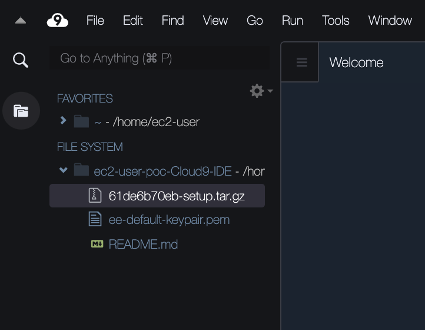

<!-- Cloud9 터미널에서 아래와 같은 명령으로 압축을 해제합니다.

``` shell
sudo tar zxvf <unique-string>-setup.tar.gz -C /greengrass/
``` -->

<!-- 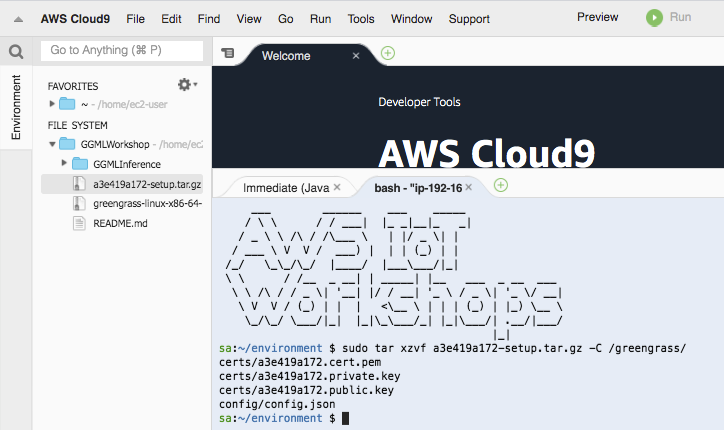 -->

#### 사물(thing)의 역할을 하는 EC2에 tar.gz-file 복사

본 워크샾에서는 EC2를 IoT의 사물(thing)으로써 사용합니다.
사물(thing)의 역할을 하는 EC2에 tar.gz-file을 복사합니다.

아래와 같은 형식의 명령을 사용합니다.

`` shell
scp -i <키페어 파일 이름> <tar.gz 파일 이름> ubuntu@ec2-18-215-162-143.compute-1.amazonaws.com:~
```

아래는 예제입니다.

`` shell
scp -i "ee-default-keypair.pem" 61de6b70eb-setup.tar.gzubuntu@ec2-18-206-222-84.compute-1.amazonaws.com:~
```

#### 사물(thing)의 역할을 하는 EC2에 접속

본 워크샾에서는 EC2를 IoT의 사물(thing)으로써 사용합니다.

먼저, Cloud9에서 터미널을 추가로 생성합니다 (New Terminal).

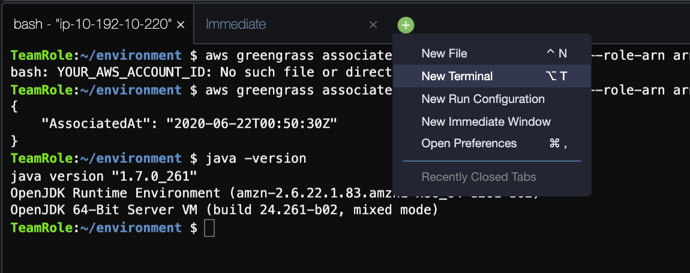

사물(thing)의 역할을 하는 EC2에 접속하기 위하여 Cloud9의 터미널에서 하기 명령을 실행합니다.

``` shell
ssh -i <키페어 파일 이름> ubuntu@<사물(thing)의 역할을 하는 EC2 서버 주소>
```

아래는 예제입니다.

``` shell
ssh -i "ee-default-keypair.pem" ubuntu@ec2-18-206-222-84.compute-1.amazonaws.com
```

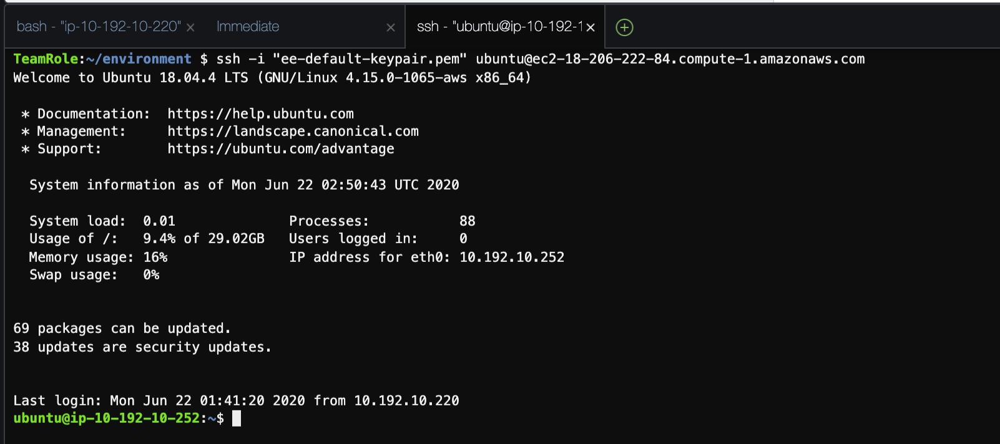

#### Updating greengrass Core software

***사물(thing)의 역할을 하는 EC2에 연결된 terminal***에서 하기 명령을 통해서 tar.gz-file 을 압축 해제 합니다.

``` shell
sudo tar zxvf <unique-string>-setup.tar.gz -C /greengrass/
```

아래는 예제입니다.

``` shell
sudo tar zxvf 61de6b70eb-setup.tar.gz -C /greengrass/
```
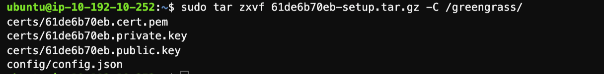


#### ATS 루트 CA 인증서를 다운로드

***사물(thing)의 역할을 하는 EC2에 연결된 terminal***에서 ATS 앤드포인트에 접근하기 위하여 ATS 루트 CA 인증서를 다운로드합니다.

``` shell
cd /greengrass/certs/
sudo wget -O root.ca.pem https://www.amazontrust.com/repository/AmazonRootCA1.pem
```

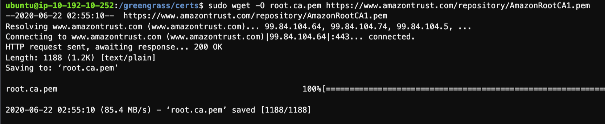

#### Greengrass Core 시작

<!-- 이제 Greengrass Core를 시작할 준비가되었습니다.

Greengrass Core를 시작하기 전에 [AWS IoT Core console](https://console.aws.amazon.com/iot/)로 이동한 후 Test 메뉴를 이용하여, ***$aws/events/#*** 와 ***$aws/things/#*** 토픽을 구독 신청합니다.

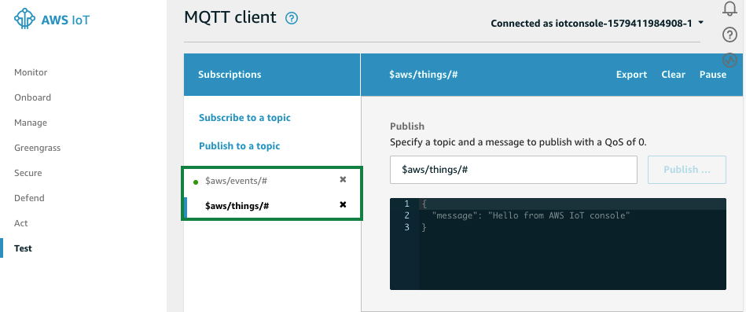 -->

***사물(thing)의 역할을 하는 EC2에 연결된 terminal***에서 아래 명령을 실행합니다.

```
cd /greengrass/ggc/core
sudo ./greengrassd start
```


<!-- 그리고, 다시 AWS IoT Core 콘솔에서 MQTT client의 출력을 확인합니다.

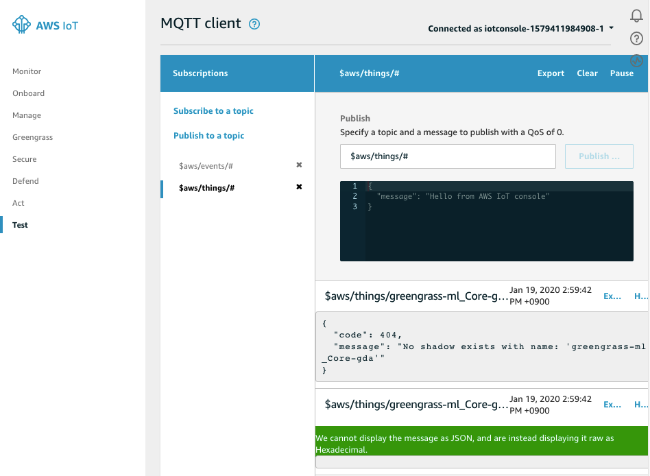 -->


#### Greengrass Core 로그

***사물(thing)의 역할을 하는 EC2에 연결된 terminal***에서 Greengrass Core의 로그 디렉토리에 액세스하려면 root 사용자로 전환해야 합니다.

``` shell
sudo su -
```

***사물(thing)의 역할을 하는 EC2에 연결된 terminal***에서 아래 명령을 실행합니다:

``` shell
cd /greengrass/ggc/var/log/system/
tail -f *.log
```

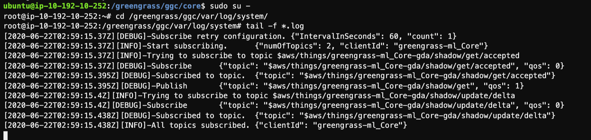


<!-- AWS Greengrass를 시작할 때 문제가 발생하면 "crash.log"파일에서 오류를 확인하십시오(문제가 없을 경우 이 단계는 건너 뛰시면 됩니다.).

``` shell
sudo cat /greengrass/ggc/var/log/crash.log
``` -->

***사물(thing)의 역할을 하는 EC2에 연결된 terminal***에서 잠시 후 ***Ctrl +C***를 입력하여 로그 보기를 중단합니다.

#### Enable Logging for Greengrass

Greengrass Core에는 기본적으로 로깅이 사용되지 않습니다. Core에서 발생하는 상황을 파악하고 문제 해결을 위해 로깅을 활성화해야합니다.

[Greengrass console](https://console.aws.amazon.com/greengrass/)로 이동한 후, Groups 메뉴를 선택합니다.

그리고, 앞서 생성한 ***greengrass-ml***을 클릭합니다.

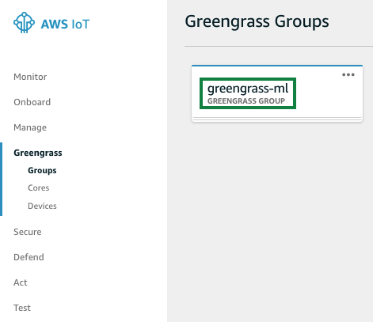

***Settings***를 클릭하고, 페이지를 아래로 스크롤합니다.

Local logs configuration 에서 ***Edit***를 클릭합니다.
***Add another log type***를 클릭합니다.

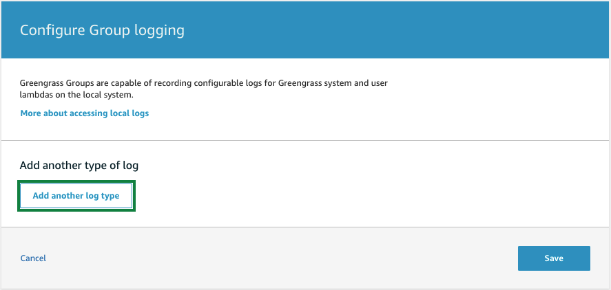

***User Lambdas*** 와 ***Greengrass system*** 을 모두 체크하고 ***update***를 클릭합니다.

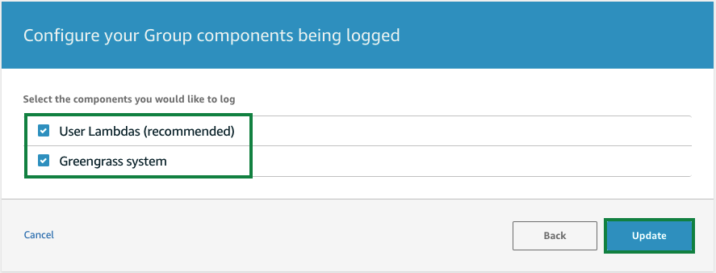

나머지 설정 값들은 default로 그대로 두고 ***Save***를 클릭합니다.
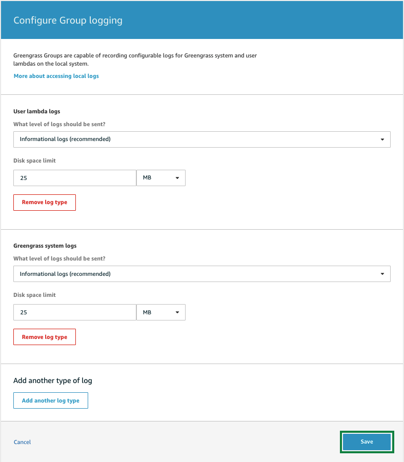

Greengrass Core의 Log files은 아래에 생성됩니다.

* Log directory: /greengrass/ggc/var/log
* System logs: /greengrass/ggc/var/log/system
* Lambda logs: /greengrass/ggc/var/log/user/<AWS_REGION>/<ACCOUNT_ID>

Greengrass Group을 만들거나 변경 한 후에는 구성을 Greengrass Core에 배포해야합니다.

먼저 ***사물(thing)의 역할을 하는 EC2에 연결된 terminal***에서 다음 명령을 실행합니다.

``` shell
sudo su -
cd /greengrass/ggc/var/log/system
tail -f localwatch/localwatch.log *.log
```

[Greengrass console](https://console.aws.amazon.com/greengrass/)로 이동한 후, Groups 메뉴를 선택합니다.

그리고, 앞서 생성한 ***greengrass-ml***을 클릭합니다.


***Actions -> Deploy***를 클릭합니다.

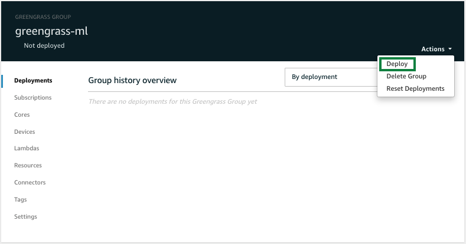

***Automatic detection*** 을 클릭합니다.

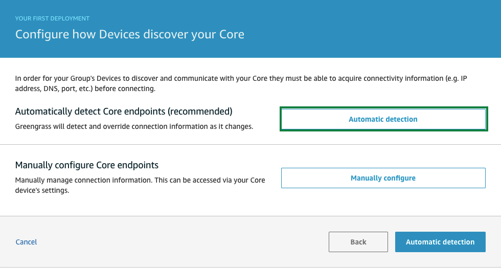

정상적으로 deploy가 완료되면 콘솔에 ***Successfully completed***로 표시됩니다.

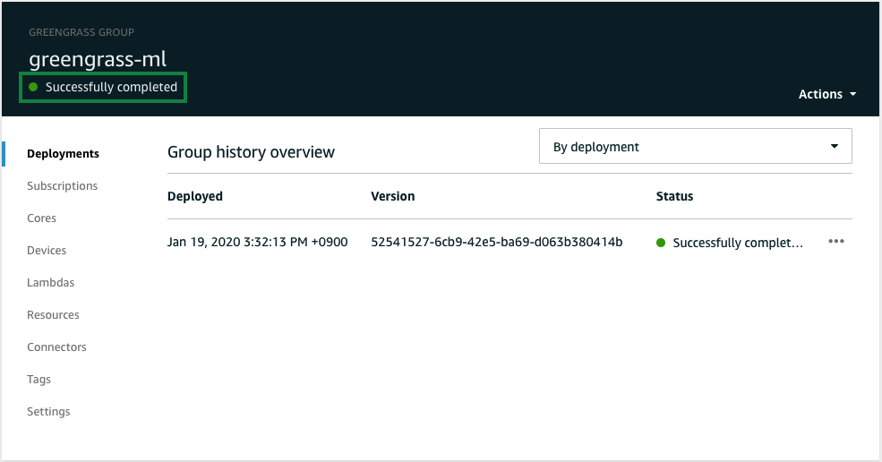

***사물(thing)의 역할을 하는 EC2에 연결된 terminal***에 새로운 로그가 보여집니다.

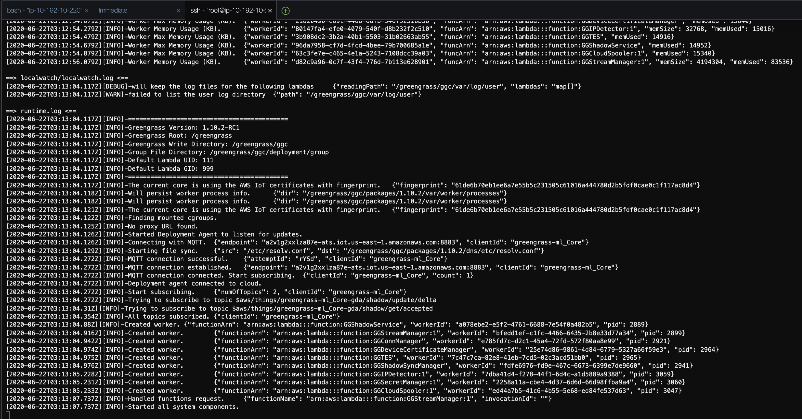


---
<p align="center">
© 2020 Amazon Web Services, Inc. 또는 자회사, All rights reserved.
</p>
