#### Create ML-Inference Lambda

이제 Lambda 함수를 만들어야합니다. 이 Lambda 기능은 Greengrass Core에 배포됩니다. 이 기능은 SageMaker에서 이전에 학습한 기계 학습 모델을 로드합니다. 그런 다음 정기적으로 이미지 디렉토리를 스캔합니다. 이미지가 발견되면 모델별로 분류되어 결과가 클라우드로 전송됩니다.\
Lambda 함수에는 나중에 연습에서 두 가지 리소스가 할당됩니다.

* 기계 학습 리소스 : 학습한 모델
* 볼륨 자원 (volume resource) : 이미지를 스캔하는 디렉토리

Greengrass에서 실행해야하는 Lambda 함수에는 버전이 있어야합니다. 버전 외에도 함수 별칭(alias)을 작성합니다.\
Greengrass의 요구 사항은 아니지만 Greengrass에서 리소스를 쉽게 할당하거나 구독을 만들 수 있습니다. 리소스/구독이 버전에 할당되면 새 버전의 Lambda를 배포할 때 업데이트해야 하는데, 별칭(alias)을 사용하면 이러한 번거로움을 피할 수 있습니다. 새 버전을 만든 경우 새 버전에 별칭(alias)만 지정하면 됩니다.

#### Greengrass Group에 ML-Inference Lambda 할당

Greengrass에서 Lambda 함수를 사용하려면 AWS Lambda에서 생성된 함수를 Greengrass Group에 할당해야 합니다.\
Greengrass의 Lambda 기능은 디렉토리에서 이미지를 정기적으로 스캔해야 하므로 long running function으로 구성됩니다.

[Greengrass console](https://console.aws.amazon.com/greengrass/)로 이동한 후, Groups 메뉴를 선택합니다.

그리고, 앞서 생성한 ***greengrass-ml***을 클릭합니다.

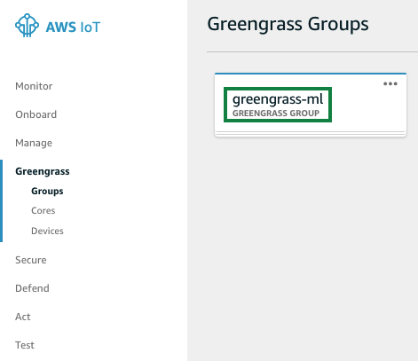

Lambdas를 선택하고, ***Create New Lambda***를 클릭합니다.


브라우저의 새 탭에서 Lambda Service console로 자동으로 이동됩니다.
Create function 화면에서 Function name에는 ***GGMLInference***을 입력하고 runtime은 ***Python 3.7***을 선택하고, 오른쪽 아래 ***Create function***을 클릭합니다.

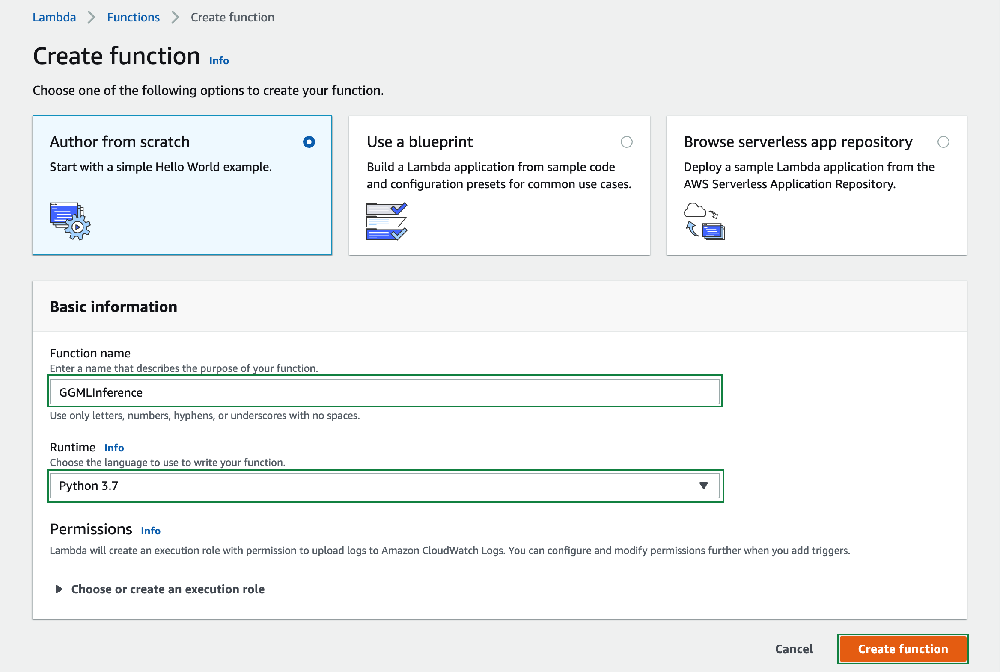

Function code 화면에서 ***upload a file from s3***를 클릭합니다.
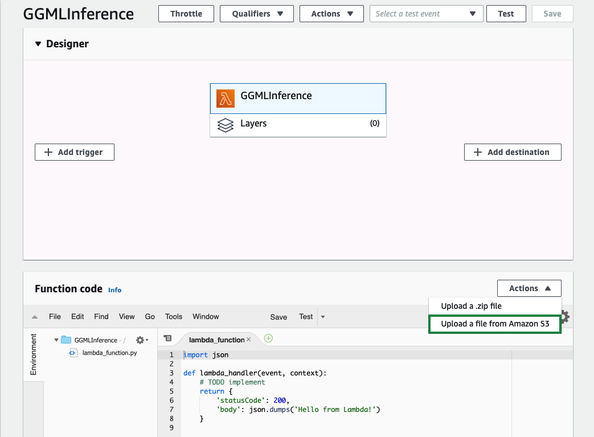

Upload a file from Amazon S3 팝업이 보여지면, Amazon S3 link URL에 ***https://sehyul-iot-greengrass.s3.amazonaws.com/lambda-xgboost/lambda_function.zip***을 입력하고 ***Save***를 클릭합니다.

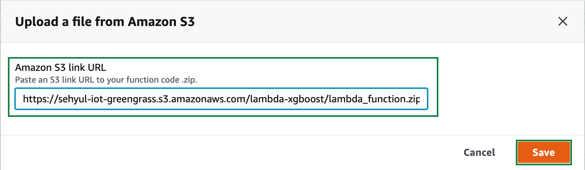

***Actions***에서 ***Publish new version***을 선택합니다.

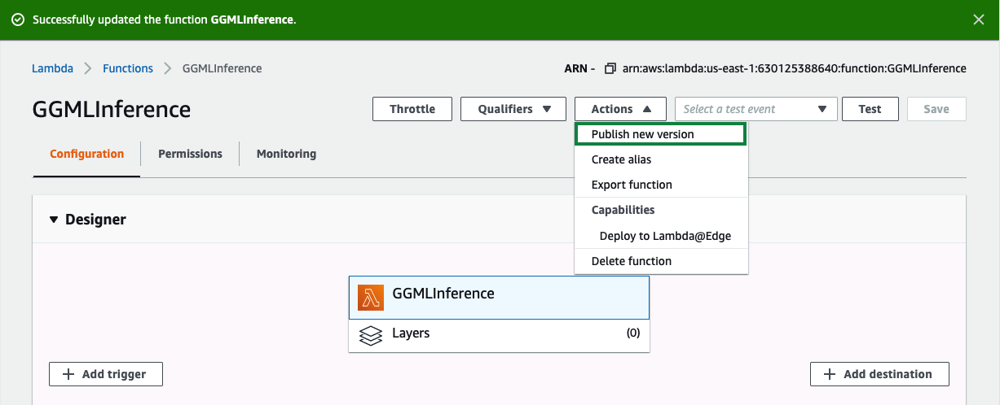

Version description은 그대로 비워 놓으셔도 됩니다. Publish를 클릭합니다.

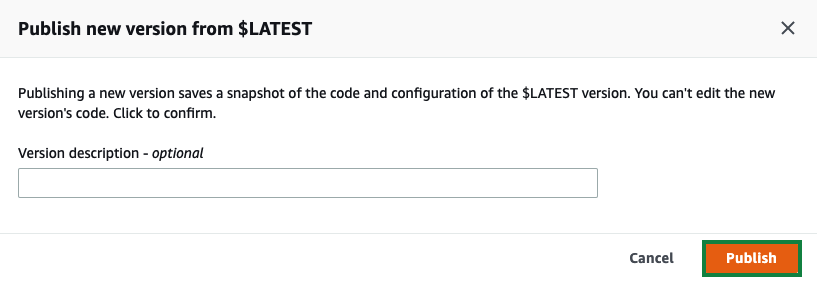

다시 ***Actions***에서 ***Create alias***을 선택합니다.

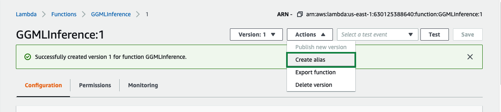

Name: dev, Version: 1 (또는 최신 버전)을 립력하고 ***Create***를 클릭합니다.

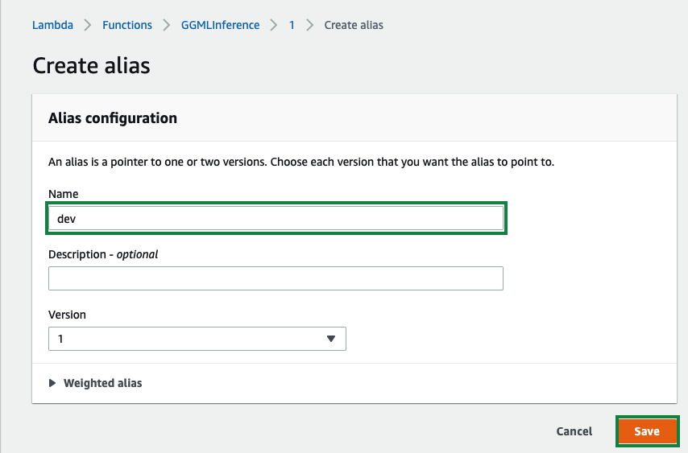


브라우저의 다른 탭에서 다시 Greengrass console로 돌아와서 이번에는 ***Use existing Lambda***를 클릭합니다.

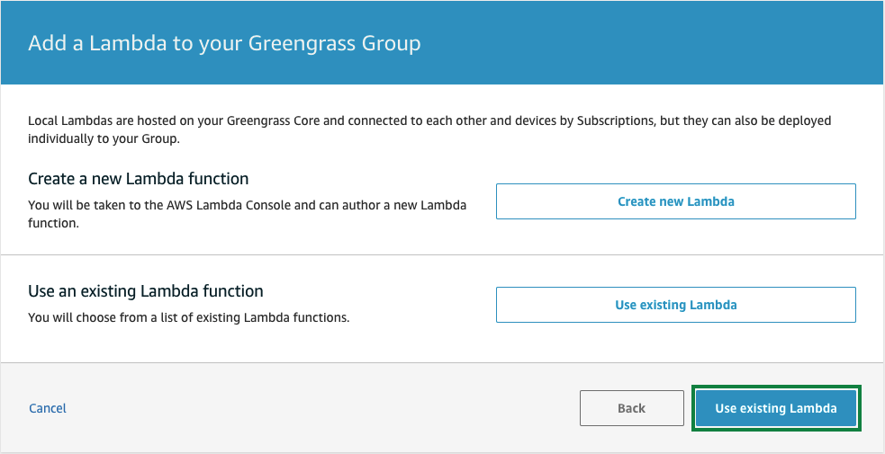

조금 전 생성하신 ***GGMLInference*** lambda 함수를 선택합니다.

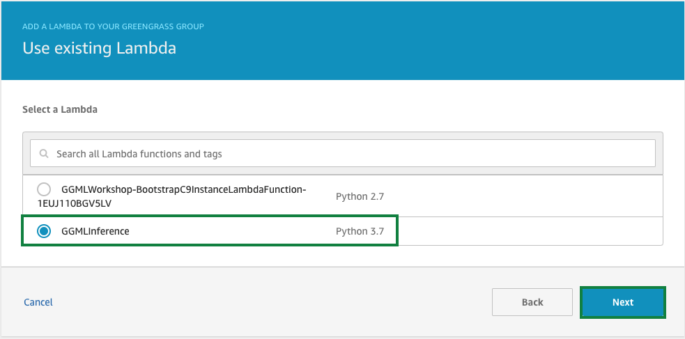

***Alias: dev***를 선택하고 ***Finish***를 클릭합니다.

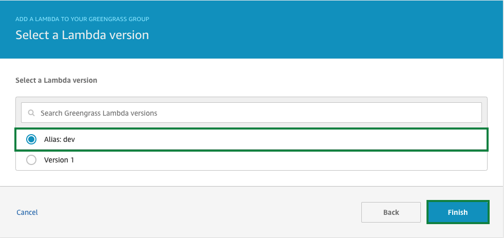

추가된 lambda에서 ...메뉴를 클릭하고 ***Edit configuration***를 클릭합니다.
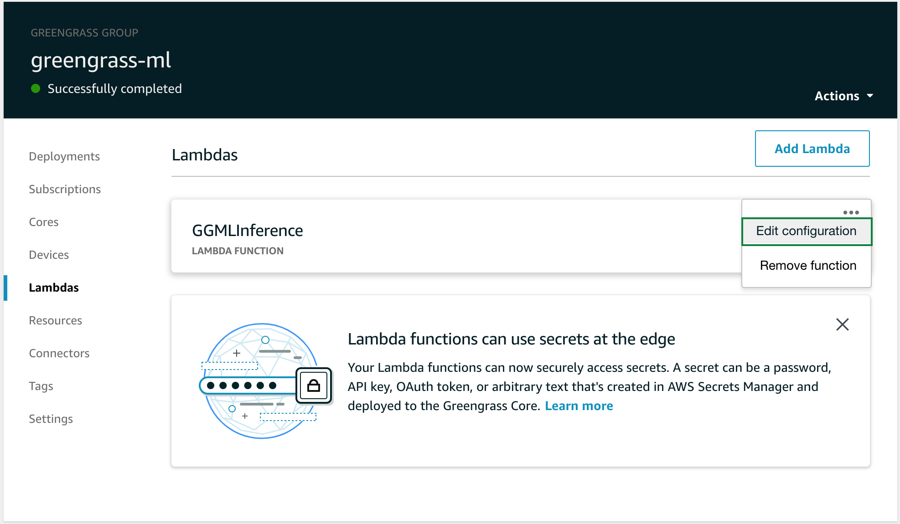

Memory limit: ***1024 MB*** 로 설정하고
***Make this function long-lived and keep it running indefinitely***를 선택하고, ***update***를 클릭합니다.

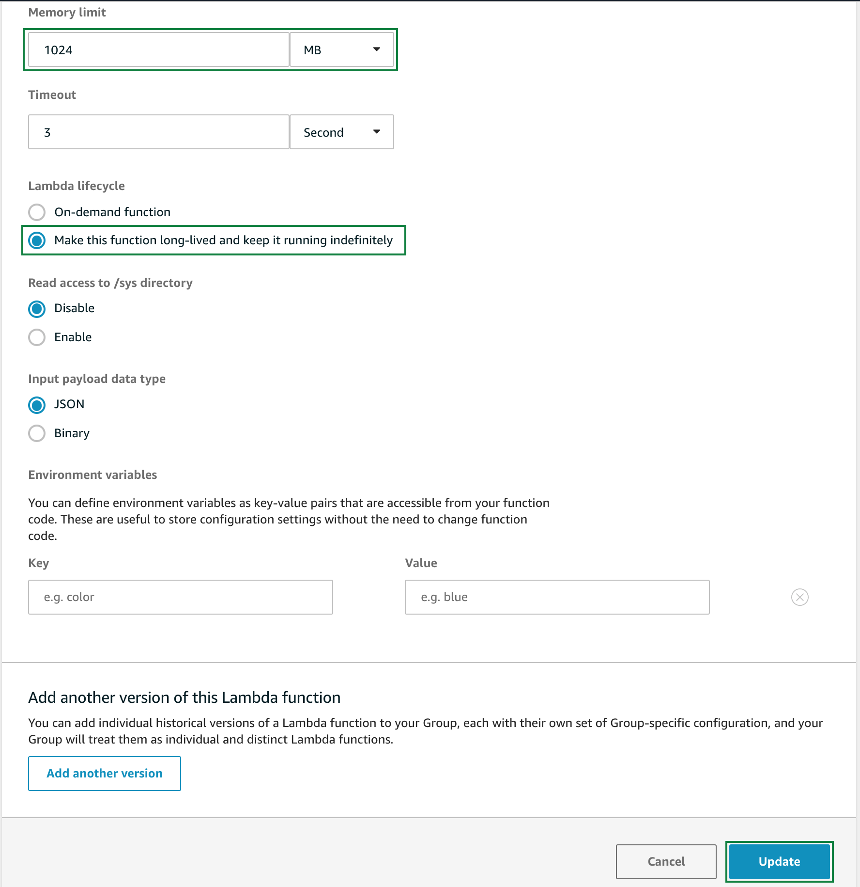

#### Greengrass Group에 Resources 할당

Lambda 함수에서 사용하려면 SageMaker를 사용하여 생성한 이미지 분류 모델을 Greengrass Group에 Machine Learning Resource로 할당해야합니다. 또한 이미지를 검색(scan)할 디렉토리는 로컬 자원으로 지정되어야 합니다.

[Greengrass console](https://console.aws.amazon.com/greengrass/)로 이동한 후, Groups 메뉴를 선택합니다.

그리고, 앞서 생성한 ***greengrass-ml***을 클릭합니다.


Resources를 클릭하고 Local탭에서 ***Add a local resource***를 클릭합니다.
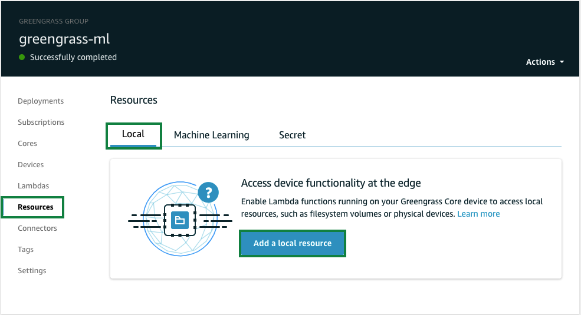

그리고, 아래와 같이 설정합니다.

* Resource name: ***ImageDirectory***
* Check Volume에서
  * Source path: ***/greengrass-ml/images/cifar10***
  * Destination path: ***/images***
* ***Automatically add OS group permissions of the Linux group that owns the resource***을 선택
* Lambda function affiliations 에서 ***GGMLInference***을 선택하고, ***Read and write access***을 선택

***Save***를 클릭하여 변경 사항을 저장합니다.
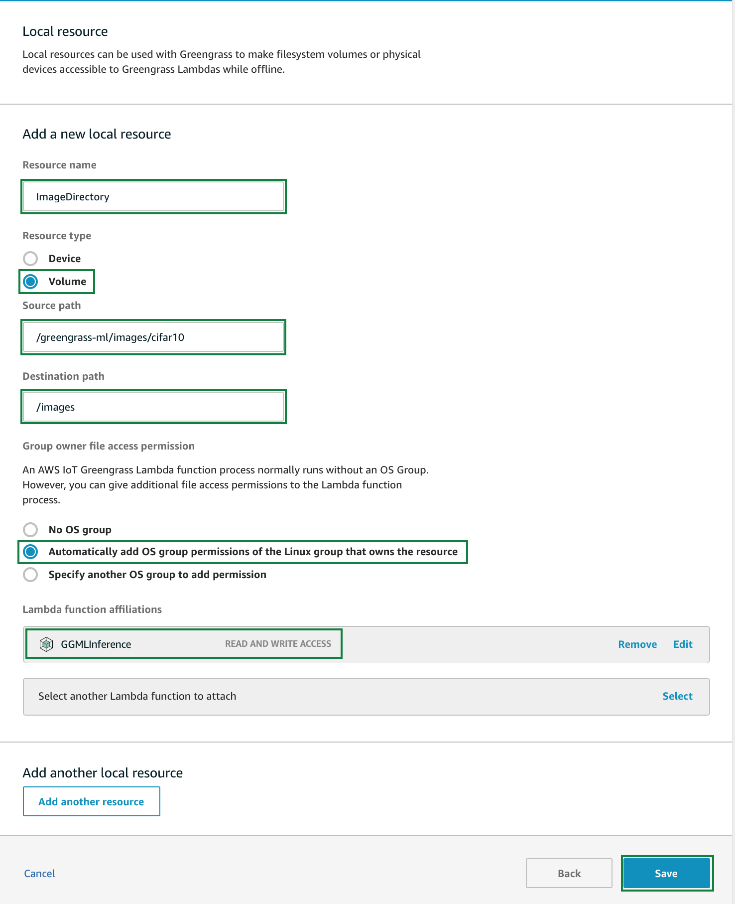


Machine Learning tab에서 ***Add a machine learning resource***를 클릭합니다.
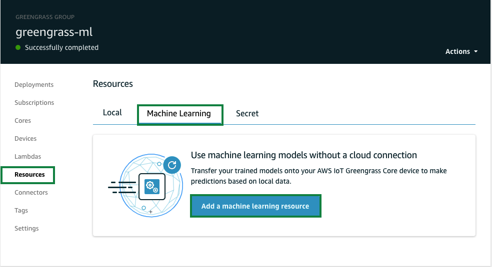

* Resource name: ***ModelImageClassification***
* ***Use a model trained in AWS SageMaker*** 선택
* SageMaker model: SageMaker에서 모델을 학습하는 데 사용된 Traning job 이름을 선택하십시오. ***greengrass-ml-cifar10-year-month-day-hour-minute-second-millisecond***와 같은 형식으로 보여집니다.
* Local path: ***/models/image-classification***
* Lambda function affiliations: ***GGMLInference>*** 선택하고, ***Read-only access***으로 그대로 둡니다.

***Save***를 클릭하여 변경 사항을 저장합니다.

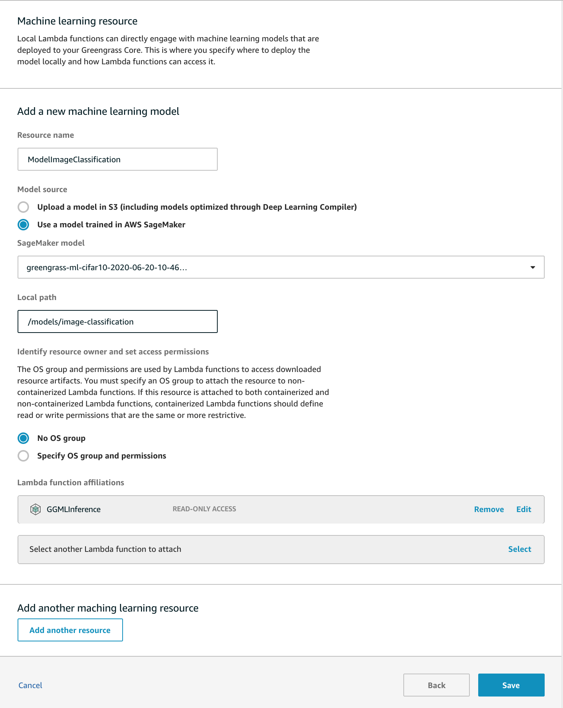

#### 구독(Subscription) 생성

구독(subscription)은 소스(source), 대상(target) 및 주제 필터(topic filter)로 구성된 라우팅 규칙입니다. 구독(subscription)은 어떤 소스(source)가 어떤 주제(topic)와 통신할 수 있는지 정의합니다.
이미지 분류를 수행하는 Lambda 함수는 이미지를 찾거나 분류했을 때 메시지를 생성합니다. 이러한 메시지는 AWS 클라우드로 전송되어야 합니다.

[Greengrass console](https://console.aws.amazon.com/greengrass/)로 이동한 후, Groups 메뉴를 선택합니다.

그리고, 앞서 생성한 ***greengrass-ml***을 클릭합니다.


Subscriptions을 선택하고, ***Add Subscription***을 클릭합니다.\
다음과 같이 선택한 후, ***Next***를 클릭합니다.\
Ssource: ***Lambdas*** -> ***GGMLInference***\
Target: ***Services*** -> ***IoT Cloud***

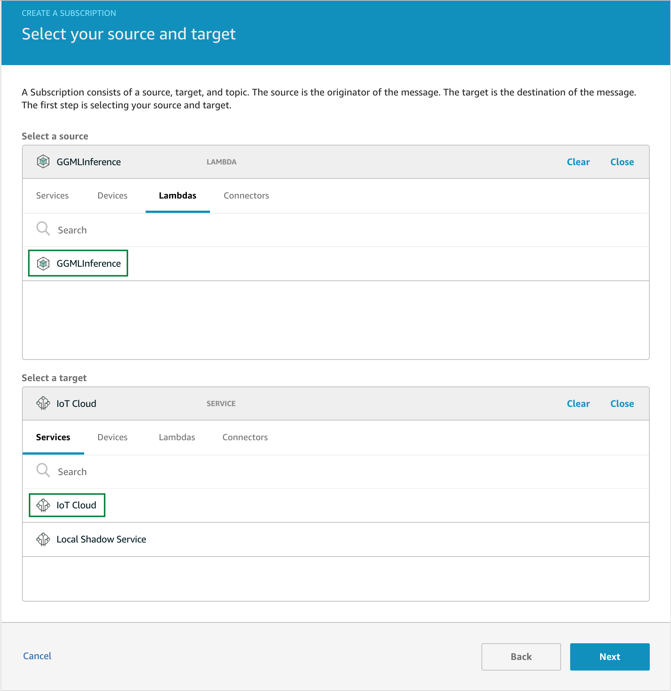

topic filter: ***greengrass/ml/inference/#***와 같이 입력합니다(선택 사항)\
***Next***를 클릭합니다.

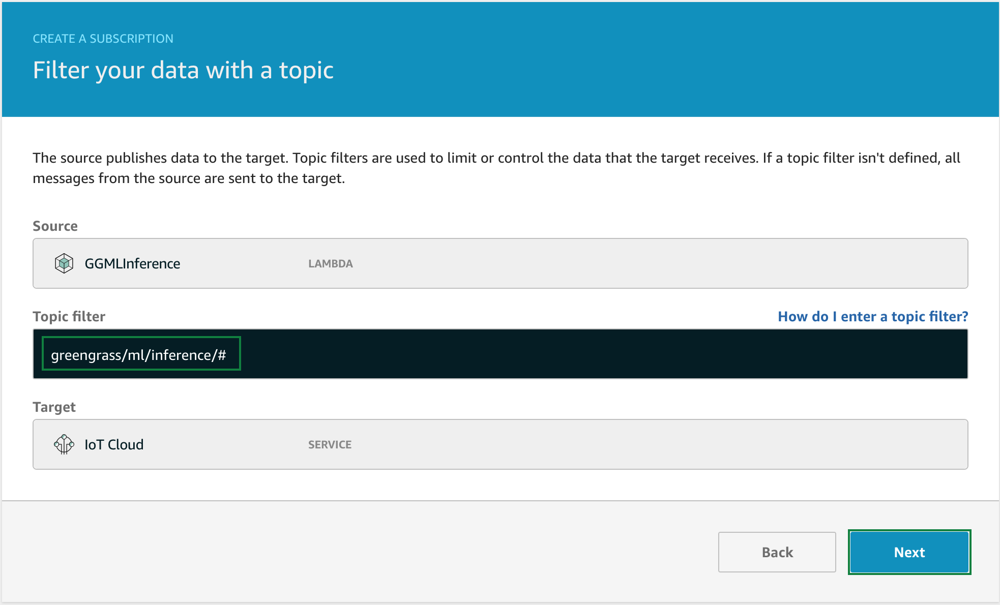

***Finish***를 클릭합니다.

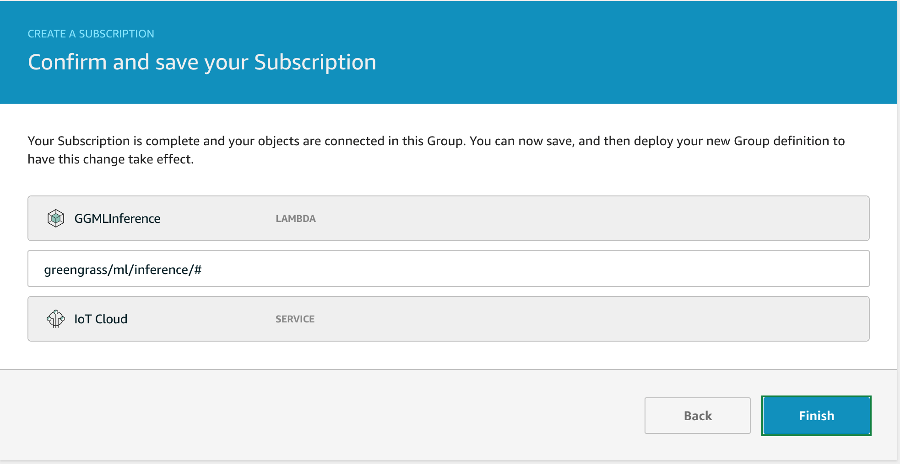

***Actions*** -> ***Deploy***를 클릭합니다.

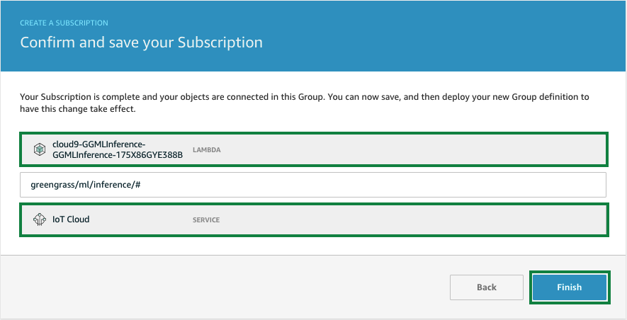

#### 이미지 분류 Classify Images

Lambda 함수는 5 초마다 ***/greengrass-ml/images/cifar10*** 디렉토리를 검색합니다. png 또는 jpg 형식의 이미지 이미지가 발견되면 ml 모델을 사용하여 분류됩니다. 분류 결과는 MQTT 메시지로 게시되고 AWS 클라우드로 전송됩니다.

EC2 인스턴스에서 ***~/greengrass-ml/images*** 디렉토리에 예제 이미지가 있습니다. Lambda가 스캔하는 디렉토리에 하나 이상의 이미지를 복사하고 AWS 클라우드에서 결과를 찾고 Lambda 함수의 로그 파일도 살펴보십시오.

[AWS IoT Core console](https://console.aws.amazon.com/iot/)로 이동 후에, Test 메뉴에서 다음 topic을 구독(subscribe)합니다.

* greengrass/ml/inference/#

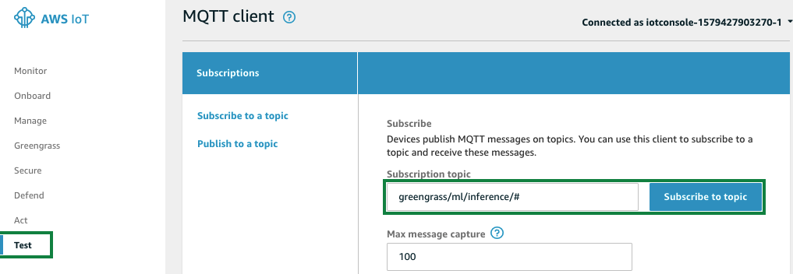

Cloud9 terminal에서 (root user로) 하기 명령을 실행합니다:

```
sudo su -
cd /greengrass/ggc/var/log/user/[YOUR_AWS_REGION]/[YOUR_AWS_ACCOUNT_ID]
tail -f cloud9-GGMLInference-GGMLInference-*.log  
```

아래는 예제입니다.

```
sudo su -
cd /greengrass/ggc/var/log/user/us-east-1/714811826601
tail -f cloud9-GGMLInference-GGMLInference-*.log  
```

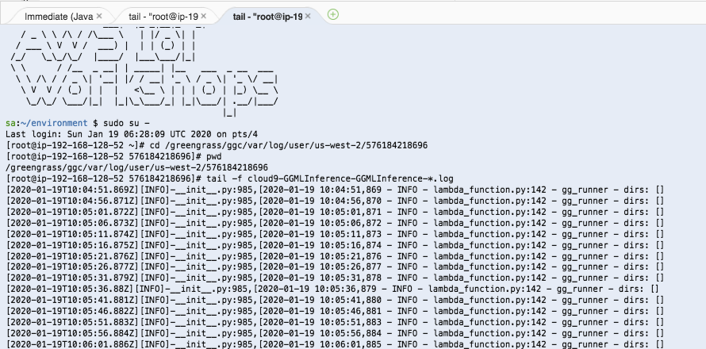

Cloud9 terminal을 하나 더 추가하고 (ec2-user로) 하기 명령을 실행합니다:

```
cd ~/greengrass-ml/images/
sudo cp bird1.png /greengrass-ml/images/cifar10
```

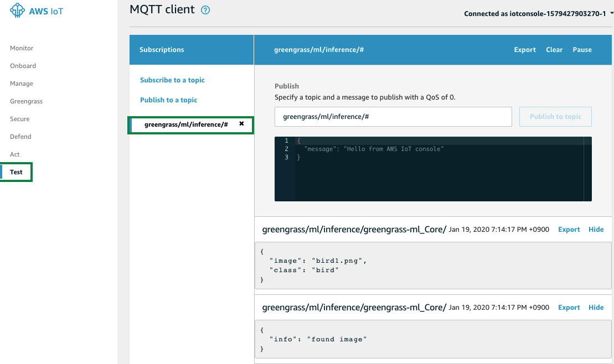

***greengrass/ml/inference/greengrass-ml_Core*** 주제(topic)에서 다음과 유사한 메시지를 수신해야 합니다.

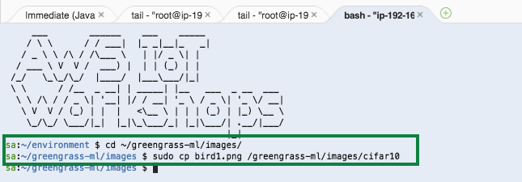

***~/greengrass-ml/images/*** 폴더 내의 다른 이미지를 사용하여 추가적인 테스트를 할 수 있습니다.

* airplane1.png
* automobile1.png
* bird1.png
* cat1.png
* deer1.png
* dog1.png
* frog1.png
* horse1.png
* plane-draw.jpeg
* ship1.png
* truck1.png

---
<p align="center">
© 2020 Amazon Web Services, Inc. 또는 자회사, All rights reserved.
</p>
