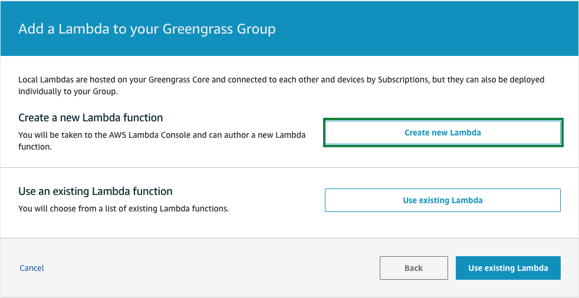
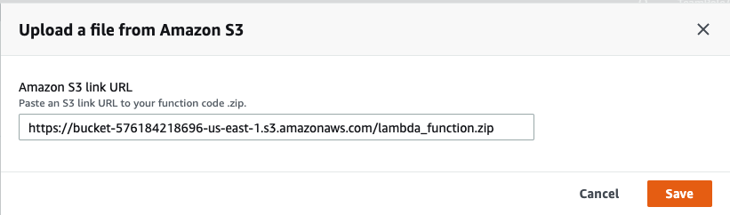
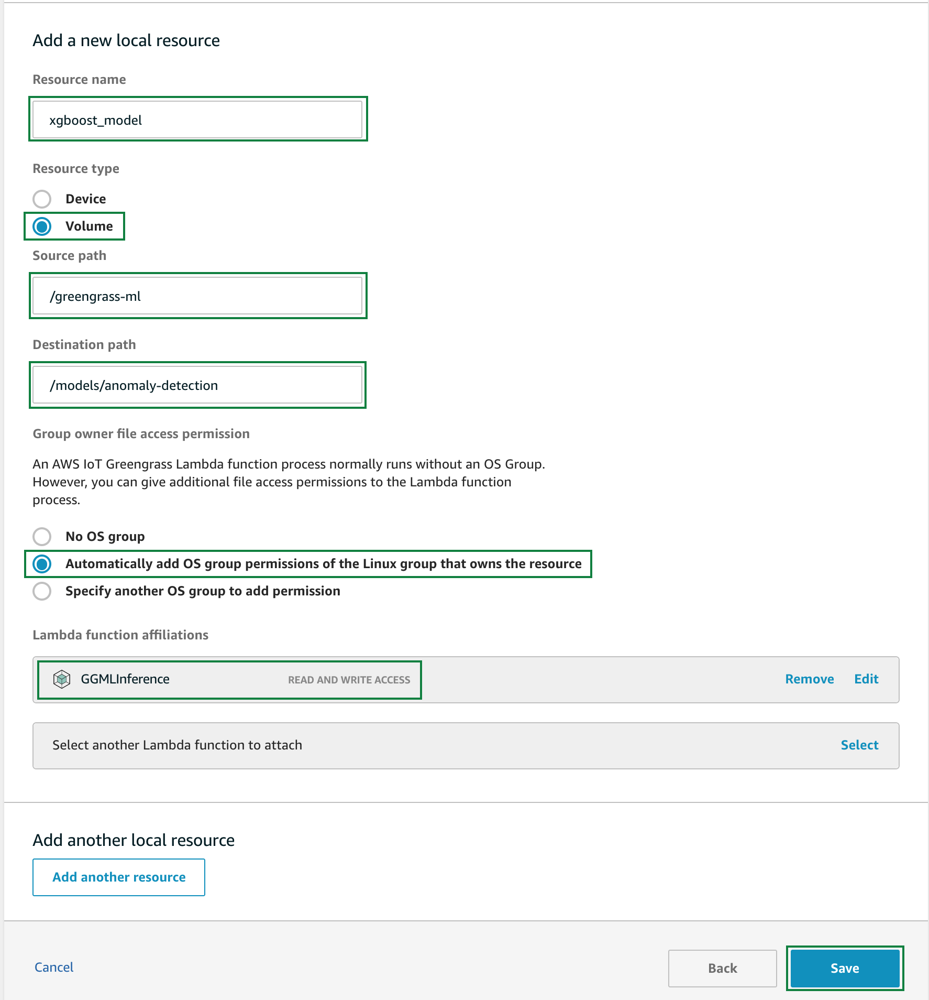
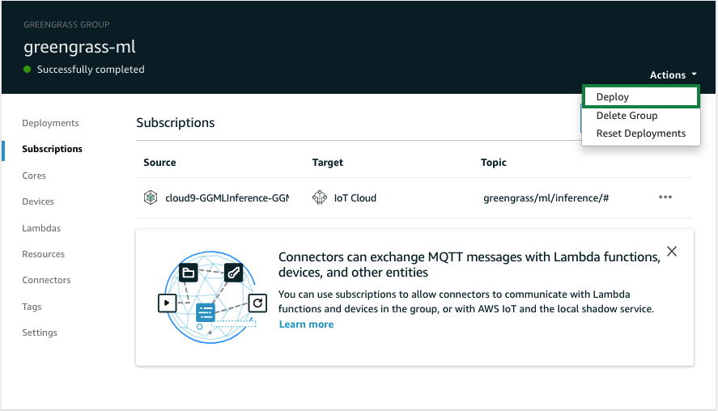
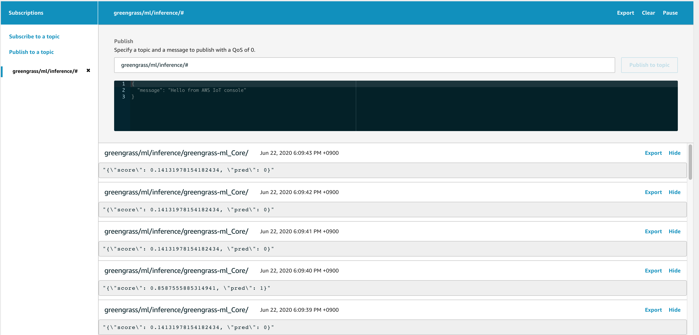

#### Create ML-Inference Lambda

이제 Lambda 함수를 만들어야 합니다. 이 Lambda 기능은 Greengrass Core에 배포됩니다. 이 기능은 SageMaker에서 이전에 학습한 기계 학습 모델을 로드합니다.

Lambda가 장비(Equipment)로 부터 "rVibration_Temp", "rVibration_Z_RMS_Velocity", "rVibration_X_RMS_Velocity", "wRMSCurrent",            "wCurrentLoad", "wEncoderVelocity" 데이터를 수집하는 상황을 가정하여 본 실습을 작성하였습니다.
이러한 상황을 가정하여 Lambda는 매초 마다 위 6가지의 데이터를 random한 값으로 발생시킵니다.

그런 다음 정기적으로 발생되는 데이터와 이전에 학습된 기계 학습 모델을 활용하여, 실린더(Cylinder)에 비정상(abnormal)한 상태가 발생될 것이라는 것을 예측합니다.
예측 결과는 클라우드로 전송되며, 이것을 통하여 예지 정비 등을 수행할 수 있습니다.

Greengrass에서 실행해야하는 Lambda 함수에는 버전이 있어야합니다. 버전 외에도 함수 별칭(alias)을 작성합니다.\
Greengrass의 요구 사항은 아니지만 Greengrass에서 리소스를 쉽게 할당하거나 구독을 만들 수 있습니다. 리소스/구독이 버전에 할당되면 새 버전의 Lambda를 배포할 때 업데이트해야 하는데, 별칭(alias)을 사용하면 이러한 번거로움을 피할 수 있습니다. 새 버전을 만든 경우 새 버전에 별칭(alias)만 지정하면 됩니다.

#### Greengrass Group에 ML-Inference Lambda 할당

Greengrass에서 Lambda 함수를 사용하려면 AWS Lambda에서 생성된 함수를 Greengrass Group에 할당해야 합니다.\
Greengrass의 Lambda 기능은 디렉토리에서 이미지를 정기적으로 스캔해야 하므로 long running function으로 구성됩니다.

[Greengrass console](https://console.aws.amazon.com/greengrass/)로 이동한 후, Groups 메뉴를 선택합니다.

그리고, 앞서 생성한 ***greengrass-ml***을 클릭합니다.

Lambdas를 선택하고, ***Create New Lambda***를 클릭합니다.

브라우저의 새 탭에서 Lambda Service console로 자동으로 이동됩니다.
Create function 화면에서 Function name에는 ***GGMLInference***을 입력하고 runtime은 ***Python 3.7***을 선택하고, 오른쪽 아래 ***Create function***을 클릭합니다.

Function code 화면에서 ***upload a file from s3***를 클릭합니다.

Upload a file from Amazon S3 팝업이 보여지면, Amazon S3 link URL에 ***https://sehyul-iot-greengrass.s3.amazonaws.com/lambda-xgboost/lambda_function.zip***을 입력하고 ***Save***를 클릭합니다.

***Actions***에서 ***Publish new version***을 선택합니다.

Version description은 그대로 비워 놓으셔도 됩니다. Publish를 클릭합니다.

다시 ***Actions***에서 ***Create alias***을 선택합니다.

Name: dev, Version: 1 (또는 최신 버전)을 립력하고 ***Create***를 클릭합니다.

브라우저의 다른 탭에서 다시 Greengrass console로 돌아와서 이번에는 ***Use existing Lambda***를 클릭합니다.

조금 전 생성하신 ***GGMLInference*** lambda 함수를 선택합니다.

***Alias: dev***를 선택하고 ***Finish***를 클릭합니다.

추가된 lambda에서 ...메뉴를 클릭하고 ***Edit configuration***를 클릭합니다.

Memory limit: ***1024 MB*** 로 설정하고
***Make this function long-lived and keep it running indefinitely***를 선택하고, ***update***를 클릭합니다.

#### Greengrass Group에 Resources 할당

Lambda 함수에서 사용하려면 SageMaker를 사용하여 생성한 이미지 분류 모델을 Greengrass Group에 Machine Learning Resource로 할당해야합니다. 또한 이미지를 검색(scan)할 디렉토리는 로컬 자원으로 지정되어야 합니다.

[Greengrass console](https://console.aws.amazon.com/greengrass/)로 이동한 후, Groups 메뉴를 선택합니다.

그리고, 앞서 생성한 ***greengrass-ml***을 클릭합니다.

Resources를 클릭하고 Local탭에서 ***Add a local resource***를 클릭합니다.

그리고, 아래와 같이 설정합니다.

* Resource name: ***xgboost_model***
* Check Volume에서
  * Source path: ***/greengrass-ml***
  * Destination path: ***/models/anomaly-detection***
* ***Automatically add OS group permissions of the Linux group that owns the resource***을 선택
* Lambda function affiliations 에서 ***GGMLInference***을 선택하고, ***Read and write access***을 선택

***Save***를 클릭하여 변경 사항을 저장합니다.

#### 구독(Subscription) 생성

구독(subscription)은 소스(source), 대상(target) 및 주제 필터(topic filter)로 구성된 라우팅 규칙입니다. 구독(subscription)은 어떤 소스(source)가 어떤 주제(topic)와 통신할 수 있는지 정의합니다.
이미지 분류를 수행하는 Lambda 함수는 이미지를 찾거나 분류했을 때 메시지를 생성합니다. 이러한 메시지는 AWS 클라우드로 전송되어야 합니다.

[Greengrass console](https://console.aws.amazon.com/greengrass/)로 이동한 후, Groups 메뉴를 선택합니다.

그리고, 앞서 생성한 ***greengrass-ml***을 클릭합니다.

Subscriptions을 선택하고, ***Add Subscription***을 클릭합니다.\
다음과 같이 선택한 후, ***Next***를 클릭합니다.\
Ssource: ***Lambdas*** -> ***GGMLInference***\
Target: ***Services*** -> ***IoT Cloud***

topic filter: ***greengrass/ml/inference/#***와 같이 입력합니다(선택 사항)\
***Next***를 클릭합니다.

***Finish***를 클릭합니다.

***Actions*** -> ***Deploy***를 클릭합니다.

#### 비정상 상태 예측 (Abnormality forecasting)

Lambda가 장비(Equipment)로 부터 "rVibration_Temp", "rVibration_Z_RMS_Velocity", "rVibration_X_RMS_Velocity", "wRMSCurrent",            "wCurrentLoad", "wEncoderVelocity" 데이터를 수집하는 상황을 가정하여, 매초 마다 위 6가지의 데이터를 random한 값으로 발생시킵니다.

Lambda에서 매 초마다 발생되는 데이터와 이전에 학습된 기계 학습 모델을 활용하여, 실린더(Cylinder)에 비정상(abnormal)한 상태에 대한 예측값을 IoT Core로 전송합니다.

[AWS IoT Core console](https://console.aws.amazon.com/iot/)로 이동 후에, Test 메뉴에서 다음 topic을 구독(subscribe)합니다.

* greengrass/ml/inference/#

---

© 2020 Amazon Web Services, Inc. 또는 자회사, All rights reserved.

